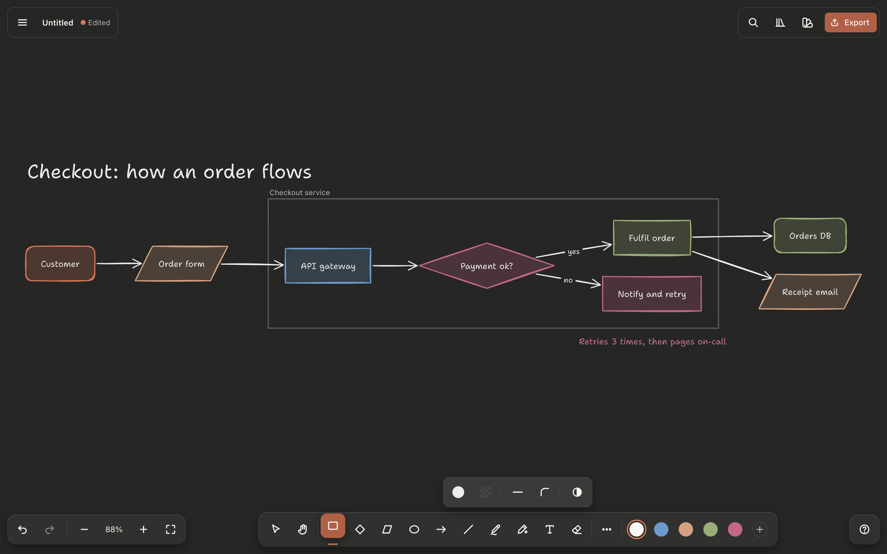
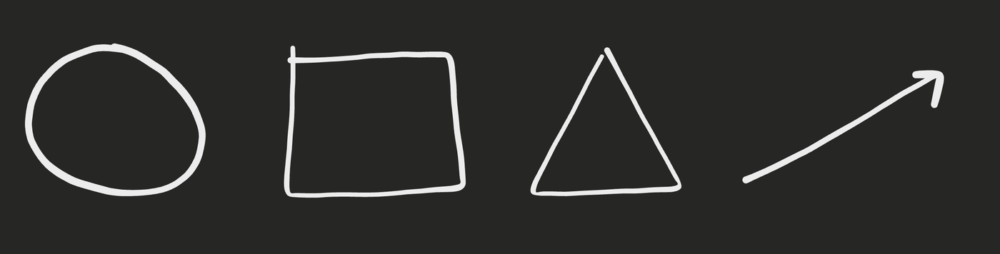
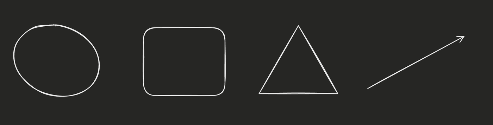
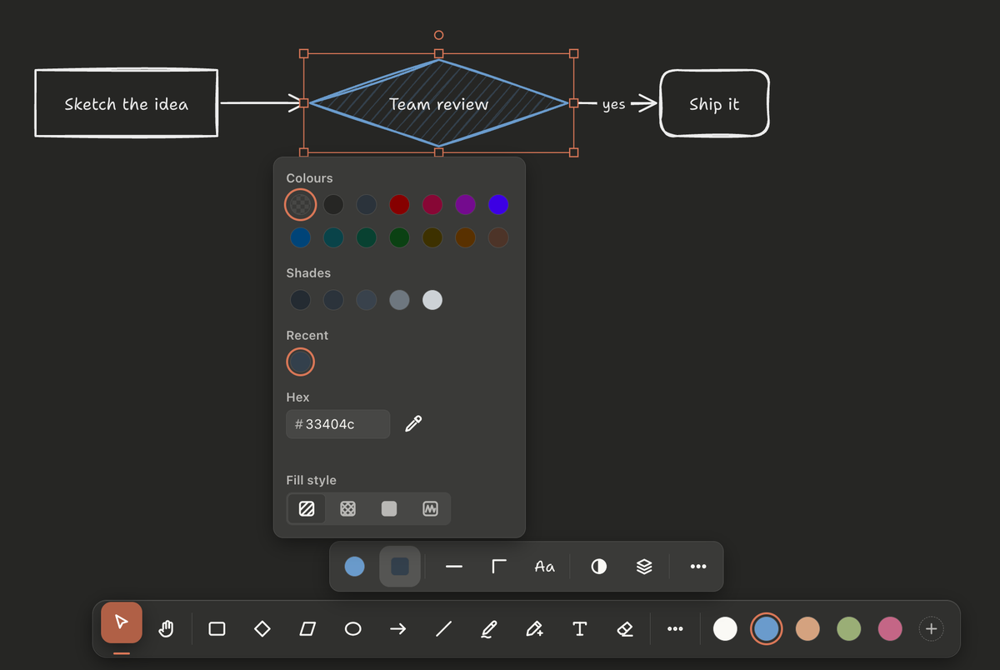
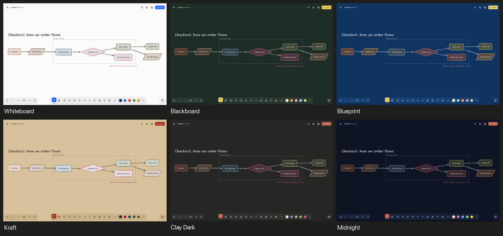
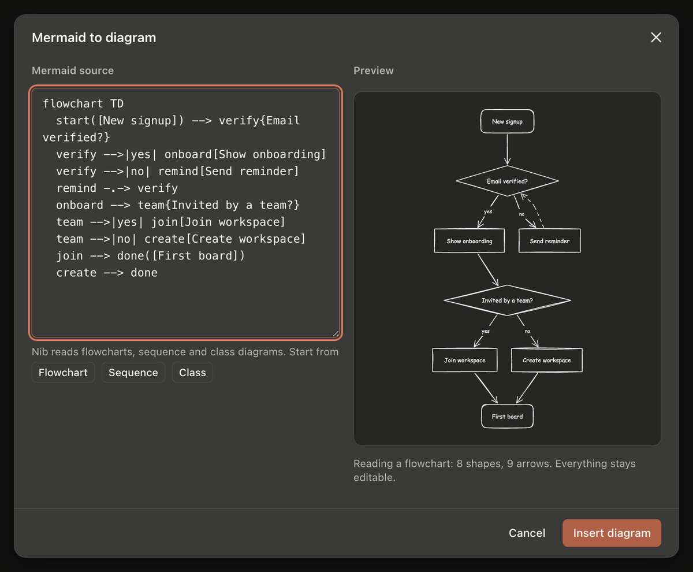
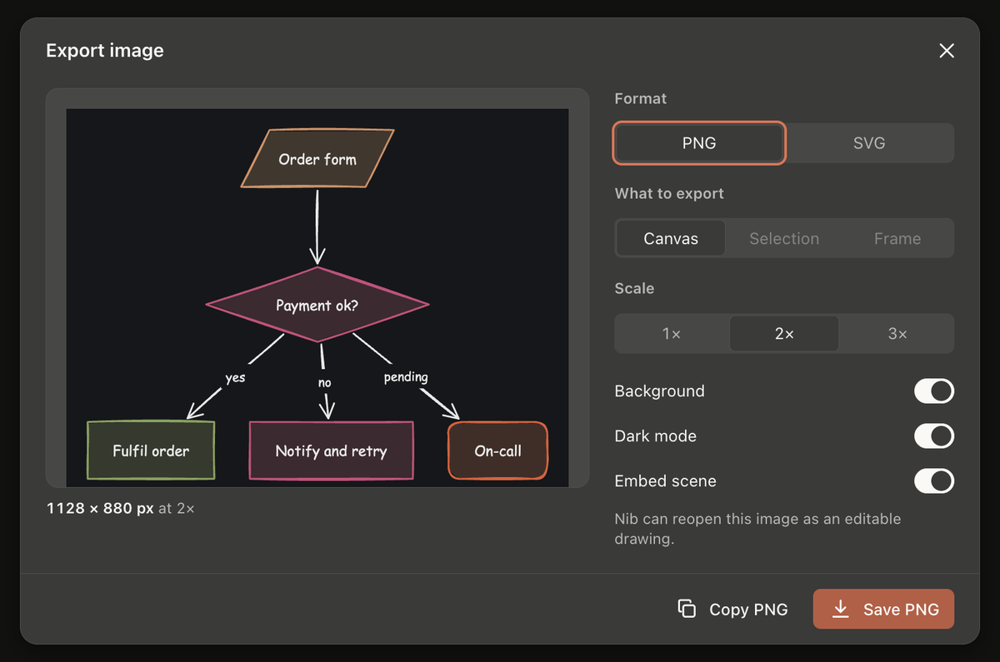

#  Nib

**A hand-drawn whiteboard that tidies up after you.**

Sketch, connect and export diagrams on an infinite canvas. Local files, no account, no network.

[](https://github.com/cyber-eternal/nib/releases/latest)

[](LICENSE)

[Download](#download) · [Highlights](#highlights) · [Shortcuts](#keyboard-shortcuts) · [Build from source](#build-from-source) · [Full feature guide](docs/FEATURES.md)



Nib is an Excalidraw-style whiteboard built as a native app for macOS and Linux
(Tauri 2) and as an installable, offline web app, all from one TypeScript
codebase. Drawings are plain JSON files (`.nibd`) that stay on your disk.

## Download

| Platform | Architecture | Download |
| --- | --- | --- |
| macOS 11+ | Universal (Apple silicon and Intel) | [Nib-macOS-universal.dmg](https://github.com/cyber-eternal/nib/releases/latest/download/Nib-macOS-universal.dmg) |
| Linux, AppImage | x86_64 | [Nib-linux-x86_64.AppImage](https://github.com/cyber-eternal/nib/releases/latest/download/Nib-linux-x86_64.AppImage) |
| Linux, AppImage | arm64 | [Nib-linux-arm64.AppImage](https://github.com/cyber-eternal/nib/releases/latest/download/Nib-linux-arm64.AppImage) |
| Debian, Ubuntu (.deb) | amd64 | [Nib-linux-amd64.deb](https://github.com/cyber-eternal/nib/releases/latest/download/Nib-linux-amd64.deb) |
| Debian, Ubuntu (.deb) | arm64 | [Nib-linux-arm64.deb](https://github.com/cyber-eternal/nib/releases/latest/download/Nib-linux-arm64.deb) |
| Fedora, openSUSE (.rpm) | x86_64 | [Nib-linux-x86_64.rpm](https://github.com/cyber-eternal/nib/releases/latest/download/Nib-linux-x86_64.rpm) |
| Fedora, openSUSE (.rpm) | aarch64 | [Nib-linux-aarch64.rpm](https://github.com/cyber-eternal/nib/releases/latest/download/Nib-linux-aarch64.rpm) |

The links always point at the newest release. Older versions are on the
[releases page](https://github.com/cyber-eternal/nib/releases).

### macOS

Open the `.dmg` and drag Nib to Applications. The app is not notarised yet, so
Gatekeeper blocks the first launch. Either right-click Nib in Applications and
choose **Open**, or clear the quarantine flag:

```bash
xattr -dr com.apple.quarantine /Applications/Nib.app
```

### Linux

```bash
# Debian, Ubuntu and derivatives
sudo apt install ./Nib-linux-amd64.deb        # or: sudo dpkg -i Nib-linux-amd64.deb

# Fedora, RHEL, openSUSE
sudo dnf install ./Nib-linux-x86_64.rpm       # or: sudo rpm -i Nib-linux-x86_64.rpm

# Any distribution
chmod +x Nib-linux-x86_64.AppImage
./Nib-linux-x86_64.AppImage
```

The packages install a `nib` command, a desktop entry and file types for
`.nibd` and `.excalidraw`. The AppImage needs FUSE 2 (`libfuse2`). Once the update feed is switched on,
the AppImage and the macOS app update themselves; `.deb` and `.rpm` installs
update through the package manager. If the
window stays blank on some NVIDIA or Wayland setups, start Nib with
`WEBKIT_DISABLE_DMABUF_RENDERER=1`.

### Web

There is no hosted copy yet. `bun run --cwd apps/desktop build` writes a static,
offline-capable web app to `apps/desktop/dist/` that you can serve from any
HTTPS host (details in [docs/FEATURES.md](docs/FEATURES.md#web)).

## Highlights

### Draw rough, get clean shapes

The Pencil (`P`) draws like a pen, then corrects the stroke when you let go. A
wobbly loop becomes an ellipse, a box becomes a rectangle, and you also get
diamonds, parallelograms, triangles, polygons, lines and arrows, each as a real,
editable shape. Scribbles and handwriting stay freehand, `Alt` keeps any stroke
as drawn, and one `⌘Z` brings your original stroke back.

| What you draw | What you get |
| --- | --- |
|  |  |

### A marker tray, not a toolbar

Every tool sits in one tray along the bottom edge, like the ledge under a
whiteboard, with the theme's five colour caps beside it. The style bar rises
above it only when there is something to style, and shows only the groups that
apply: stroke, fill (hachure, cross-hatch, solid, zigzag), stroke width and
style, edges, text, opacity and arrange.



### Eleven themes

Whiteboard, Blackboard, Graphite, Blueprint, Kraft, Legal Pad, Mint, Midnight,
Sakura, High Contrast and Clay Dark (the default). Each theme brings its own
board, tray, ink, accent and marker caps. Dark themes remap drawing colours
instead of inverting the canvas, keep strokes and text readable against
whatever is underneath, and never change the stored colours, so a drawing looks
right in any theme and in exports. **Match system** follows macOS light and
dark, and `⇧⌥D` flips between them.



### Arrows that stay attached

Drag from one shape to another, or click one and then the other. Arrows bind to
both ends and follow the shapes as they move, resize and rotate; they can be
straight, curved or elbow (routed around other shapes), with twelve arrowheads
and their own labels. **Tidy up** (`⌥T`) straightens a messy diagram: loose ends
attach, aligned shapes get straight runs, the rest get one clean bend.

### Flowcharts from the keyboard and from Mermaid

Select a shape and press `⌘` + arrow to add a connected shape in that direction,
or `⌥` + arrow to move along the connections. The Parallelogram (`G`) is there
for inputs and outputs. Paste or type a Mermaid flowchart, sequence diagram or
class diagram and it becomes ordinary shapes and bound arrows you keep editing;
subgraphs become frames.



### Your files, your formats

- **Local-first.** Drawings are `.nibd` files: plain JSON with the scene and any
  embedded images. No account, no server, no telemetry. A recovery copy is
  written seconds after you pause, so a crash costs nothing.
- **Tabs.** Keep several drawings open side by side in tabs (`⌘N` or `⌘T` for a
  new one, multi-select in Open, several files from Finder or the file manager),
  and get them back at the next launch where you left them, unsaved ones
  included.
- **Excalidraw in and out.** Open `.excalidraw` files, export to Excalidraw,
  paste Excalidraw clipboard data, and import or export `.excalidrawlib`
  libraries.
- **PNG and SVG export** at 1×, 2× or 3×, for the whole canvas, the selection
  or a frame, with or without background, in light or dark, and optionally with
  the scene embedded so the image reopens as an editable drawing.



### And the rest

- **Frames and presentation mode.** Frames (`F`) clip and carry their contents;
  View › Present frames plays them as slides, with the laser pointer (`K`).
- **Library.** Save shapes for reuse, drag them onto any drawing, and share
  them as `.excalidrawlib` files.
- **Find on canvas** (`⌘F`), a **command palette** (`⌘/`), a searchable
  **shortcut sheet** (`?`), zen mode and view mode.
- **Images and embeds.** Drop, paste and crop images; embed YouTube, Figma,
  Loom, GitHub Gist, CodePen and more in sandboxed frames.
- **Precise editing.** Lasso select, align and distribute, group, lock, flip,
  object snapping with guides, an optional grid, and a Stats panel for exact
  position, size and angle.
- **Accessible.** Every control works from the keyboard with visible focus,
  selection changes are announced, motion follows the system setting, and High
  Contrast is a full theme.

The [full feature guide](docs/FEATURES.md) covers every tool, setting and file
format in detail.

## Keyboard shortcuts

`⌘` is Ctrl outside macOS. Press `?` in the app for the full, searchable list.

| Tools | | Edit | | View and file | |
| --- | --- | --- | --- | --- | --- |
| Select | `V` `1` | Undo / Redo | `⌘Z` / `⇧⌘Z` | Command palette | `⌘/` |
| Hand (or hold Space) | `H` | Duplicate | `⌘D` | Find on canvas | `⌘F` |
| Rectangle | `R` `2` | Group / Ungroup | `⌘G` / `⇧⌘G` | Zoom in / out | `⌘=` / `⌘-` |
| Diamond | `D` `3` | Edit label / points | `Enter` / `⌘Enter` | Zoom to fit / selection | `⇧1` / `⇧2` |
| Parallelogram | `G` | Add connected shape | `⌘` + arrow | Grid / Snapping | `⌘'` / `⌥S` |
| Ellipse | `O` `4` | Go to connected shape | `⌥` + arrow | Zen / View mode | `⌥Z` / `⌥R` |
| Arrow | `A` `5` | Tidy up connectors | `⌥T` | Light / dark | `⇧⌥D` |
| Line | `L` `6` | Align | `⇧⌘` + arrow | Stats | `⌥/` |
| Pen / Pencil | `7` / `P` | Copy / Paste styles | `⌥⌘C` / `⌥⌘V` | New tab / Open | `⌘N` / `⌘O` |
| Text | `T` `8` | Link | `⌘K` | Save / Save as | `⌘S` / `⇧⌘S` |
| Image | `9` | Lock | `⇧⌘L` | Export image | `⇧⌘E` |
| Eraser | `E` `0` | Bring forward / to front | `⌘]` / `⌥⌘]` | Shortcut sheet | `?` |
| Frame / Laser / Lasso | `F` / `K` / `Q` | Send backward / to back | `⌘[` / `⌥⌘[` | Preferences | `⌘,` |

## Build from source

You need [Bun](https://bun.sh). The desktop app also needs Rust and the
[Tauri 2 prerequisites](https://tauri.app/start/prerequisites/) (Xcode command
line tools on macOS, WebKitGTK on Linux).

```bash
git clone https://github.com/cyber-eternal/nib.git
cd nib
bun install
bun run dev            # browser build with live reload at http://127.0.0.1:1420
bun run desktop        # the desktop app against the same dev server
bun run desktop:build  # Nib.app + .dmg on macOS, or .deb/.rpm/.AppImage on Linux
```

| Command | What it does |
| --- | --- |
| `bun run test` | Vitest for core, platform and editor |
| `bun run typecheck` | `tsc --noEmit` for every package |
| `bun run lint` | Biome lint and format check (`lint:fix` applies fixes) |
| `bun run desktop:release` | Universal (Apple silicon and Intel) `Nib.app` and `.dmg` |
| `apps/desktop/linux/build.sh [amd64]` | Linux packages built in Docker, from a Mac or any Docker host |
| `bun run --cwd apps/desktop build` | The offline web build in `apps/desktop/dist/` |

Desktop bundles land in `apps/desktop/src-tauri/target/…/bundle/` (Linux Docker
builds in `target-linux/`). Pushing a `v*` tag runs
[`.github/workflows/release.yml`](.github/workflows/release.yml), which builds
macOS and both Linux architectures and publishes a release with the stable
download names above. Signing, notarisation and auto-update are described in
[apps/desktop/RELEASING.md](apps/desktop/RELEASING.md).

## Project structure

```
packages/core       model, geometry, rendering, tools, history, file formats; no DOM
packages/editor     React UI: shell, marker tray, style bar, panels, dialogs, export, themes
packages/platform   the interface the editor needs from its host, plus the browser host
apps/desktop        Tauri 2 shell (Rust), native menus, Linux packaging, the web build's PWA
docs/               feature guide, roadmap, screenshots
```

`packages/core` decides what the drawing is and never touches the DOM, so it is
unit-tested in Node and reused by the SVG exporter. Every edit is a reversible
diff, which drives undo, redo, dirty tracking and the recovery copy. Files,
dialogs, menus and storage go through a `Platform` interface with a browser and
a Tauri implementation. More in [docs/FEATURES.md](docs/FEATURES.md#how-it-is-put-together);
the UI's design system is in [DESIGN.md](DESIGN.md).

## Contributing

Issues and pull requests are welcome. [CONTRIBUTING.md](CONTRIBUTING.md) covers
the dev setup, the checks to run before a PR (`bun run lint`, `bun run
typecheck`, `bun run test`, and `cargo` for the Rust shell) and the commit
style ([Conventional Commits](https://www.conventionalcommits.org/)). Please
follow the [Code of Conduct](CODE_OF_CONDUCT.md), and report security issues
privately as described in [SECURITY.md](SECURITY.md).

What is planned next is in [docs/ROADMAP.md](docs/ROADMAP.md). Real-time
collaboration is out of scope by design. Known limits are listed in
[docs/FEATURES.md](docs/FEATURES.md#what-is-not-here).

## License

[MIT](LICENSE) © 2026 Cyber-Eternal.

Nib is built on [roughjs](https://github.com/rough-stuff/rough) for the
hand-drawn strokes, [perfect-freehand](https://github.com/steveruizok/perfect-freehand)
for pressure-sensitive drawing, [Tauri](https://tauri.app) and React (all MIT).
The bundled canvas fonts are Shantell Sans, Nunito and Cascadia Code (SIL Open
Font License).
